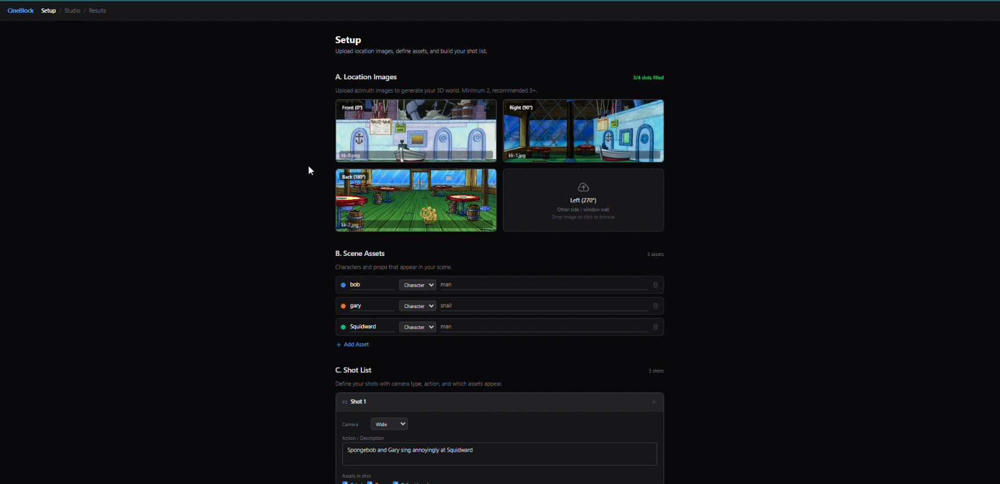
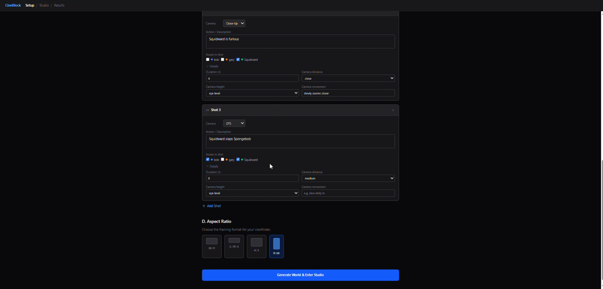
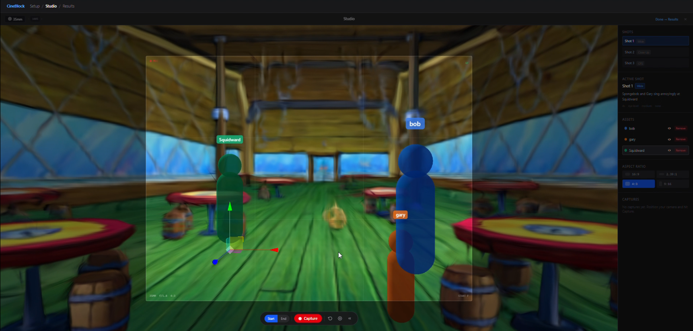
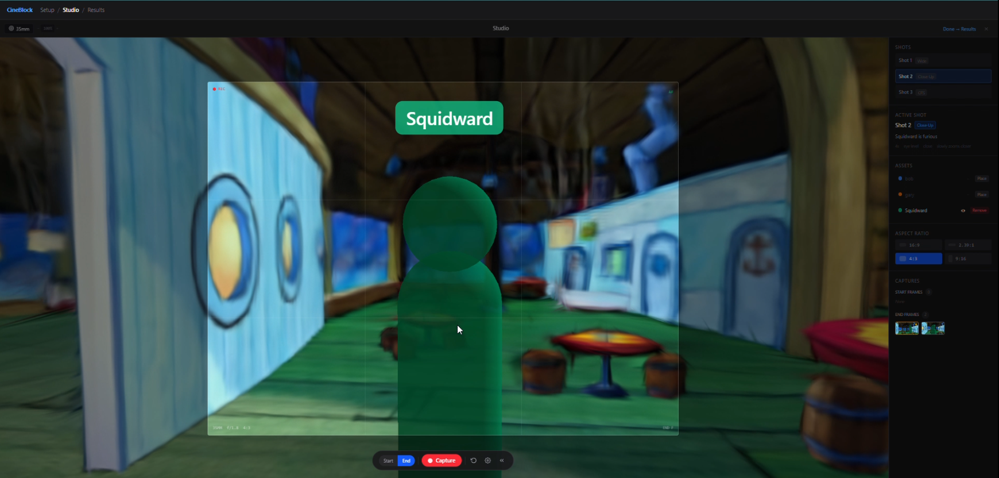
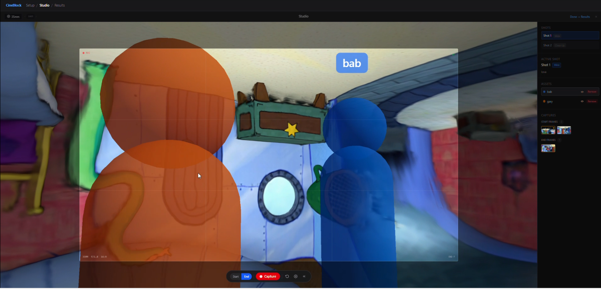
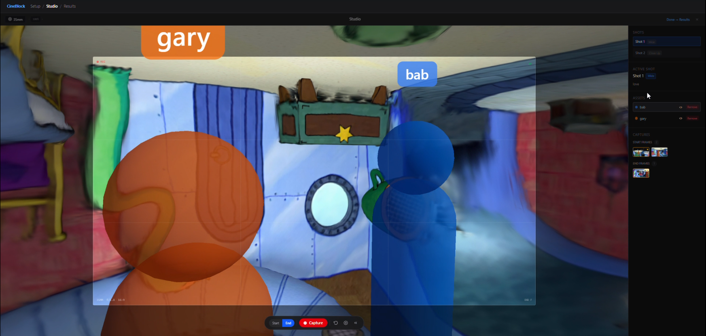
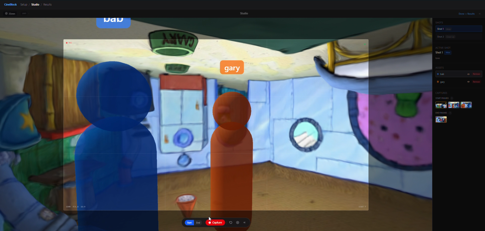
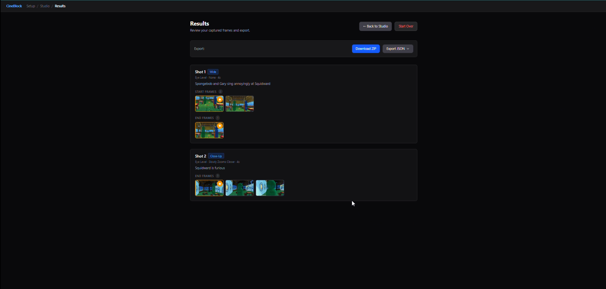

# CineBlock

A cinematic pre-visualization tool that turns reference images into explorable 3D worlds using Gaussian splatting, then lets you compose and capture shots with mannequin stand-ins for characters and props.

[](https://www.youtube.com/watch?v=9q5HhKAQlw0)

> **[Watch the demo](https://www.youtube.com/watch?v=9q5HhKAQlw0)**

## What It Does

CineBlock is a three-stage workflow for planning film/animation shots:

### 1. Setup

Upload location reference images from four azimuth angles (front, right, back, left), define characters and props with color-coded identifiers, and plan your shot list with camera types (Wide, Medium, Close-Up, OTS, POV, Two-Shot, Insert). Submitting triggers the Marble API to generate a 3D Gaussian splat world from your images.




### 2. Studio

Explore the generated 3D world in a real-time viewer. Place mannequin stand-ins (capsules for characters, boxes for props) into the scene using click-to-place raycasting, then position them with translate/rotate/scale gizmos. Frame your shots through a configurable viewfinder with aspect ratio selection (16:9, 2.39:1, 4:3, 9:16), lens presets (35mm, 50mm, 85mm), and a rule-of-thirds grid overlay. Capture start and end frames for each shot.







### 3. Results

Review all captured frames organized by shot. Select hero frames, preview in a lightbox, and export everything as a ZIP containing structured folders with images and dual-format JSON metadata (CineBlock native + Aiuteur-compatible).



## Tech Stack

| Layer | Technology |
|-------|------------|
| Framework | React 19, TypeScript 5.9 |
| 3D Rendering | Three.js r181, React Three Fiber 9, React Three Drei 10 |
| Gaussian Splats | Spark 2.0.0-preview (@sparkjsdev/spark) |
| 3D World Generation | World Labs Marble API |
| Styling | Tailwind CSS 4 |
| Build | Vite 6 |
| Testing | Vitest 4 |
| Export | JSZip, file-saver |

## Getting Started

### Prerequisites

- Node.js 18+
- A [World Labs Marble API](https://api.worldlabs.ai) key

### Install & Run

```bash
git clone <repo-url>
cd CineBlock
npm install
```

Create a `.env` file in the project root:

```
VITE_MARBLE_API_KEY=your_api_key_here
```

Start the dev server:

```bash
npm run dev
```

### Build

```bash
npm run build
npm run preview
```

### Test

```bash
npx vitest
```

## Project Structure

```
src/
  App.tsx                  # Root component with Setup/Studio/Results navigation
  store.tsx                # useReducer-based state management
  types.ts                 # Shared TypeScript interfaces
  services/
    marbleApi.ts           # World Labs Marble API client (upload, generate, poll)
  components/
    MarbleWorld.tsx         # Gaussian splat renderer + collider mesh loader
    Mannequins.tsx          # Character/prop mannequins, gizmos, overlay portal
  views/
    SetupView.tsx           # Image upload, asset/shot planning, world generation
    StudioView.tsx          # 3D viewfinder, capture pipeline, sidebar controls
    ResultsView.tsx         # Shot review, hero selection, ZIP export
  __tests__/               # Unit tests (store, API, phases 2/3/5)
```

## Controls (Studio)

| Key | Action |
|-----|--------|
| **G** | Switch gizmo to Translate mode |
| **R** | Switch gizmo to Rotate mode |
| **S** | Switch gizmo to Scale mode |
| Left-click splat surface | Place mannequin at click point |
| Orbit / Pan / Zoom | Mouse drag (OrbitControls) |
